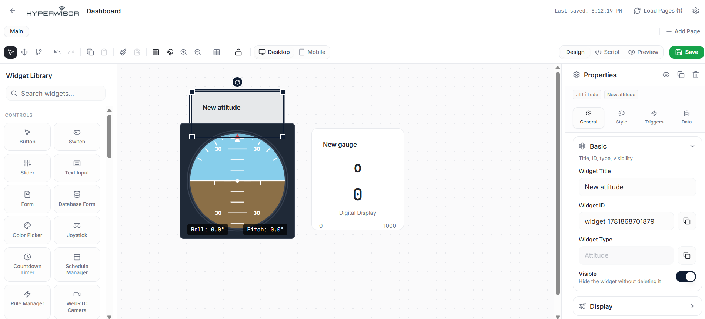
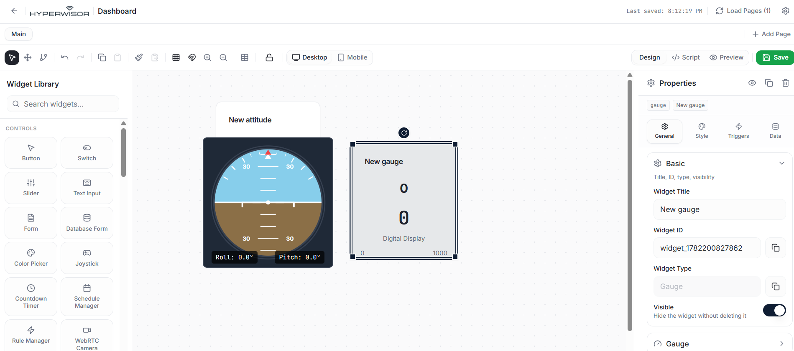

# Hyperwisor IoT MPU-6500 6-Axis Motion Tracking Telemetry

A structured IoT controller project using an ESP32 micro-controller and the Hyperwisor IoT platform. This repository demonstrates how to manually query raw data registers via an Inter-Integrated Circuit (I2C) communication bus, execute an on-chip software Complementary Filter to decouple sensor noise, and stream advanced orientation/velocity data to specialized cloud widgets.

---

## 🚀 1. How Motion Sensor Telemetry Streams Work

Multi-axis motion arrays track rapid structural orientation shifts, angular velocities, and structural vibration dynamics. Because these continuous dynamic data points flow instantly from the physical micro-controller up to your active workspace view without needing manual interactive triggers from a browser frame, it utilizes a **one-way telemetric pipeline**.

> 💡 **Architectural Best Practice:** For streaming continuous IMU sensor tracking streams, **you do not need to configure a Command Tree or register nested platform actions.** The micro-controller executes tracking computations natively on-chip and streams processed telemetry variables up to individual interface display blocks using decoupled `device.updateFlightAttitude()` and `device.updateWidget()` pipelines.

---

## 🎛️ 2. The Widget UI Builder Configuration

To render all complex motion metrics in real-time, you must deploy two distinct visual feedback components onto your custom workspace canvas layout:

1. Open your Hyperwisor visual canvas layout designer.
2. Drag one **Altitude Indicator / Artificial Horizon** widget and one standard **Radial Gauge** widget onto your page.
3. Select each component independently to reveal its target settings configuration screen on the right.
4. Replace the placeholder `"WidgetId"` string tokens inside your code configuration with the unique alphanumeric **Widget ID** tags generated by the studio:
   * **Flight Attitude Indicator Target:** Bind this component to replace your specific `device.updateFlightAttitude` string container.
   * **Gyroscope Radial Gauge Target:** Bind this component to replace your specific `device.updateWidget` string container tracking Yaw velocity.

### 📸 Flight Attitude Widget Dashboard Configuration

### 📸 Gyroscope Dial Widget Dashboard Configuration

---

## ⚙️ 3. Hardware Circuit Design & I2C Logic

The MPU-6500 module relies on a high-speed synchronous **I2C (Inter-Integrated Circuit)** serial wire bus. The custom pin layout isolates data lines to avoid shared resource collisions on your main board layout.

### Quick Wiring Rules
* **SDA (Serial Data Line):** Connect the module's `SDA` pin directly to **`GPIO 18`**.
* **SCL (Serial Clock Line):** Connect the module's `SCL` pin directly to **`GPIO 19`**.
* **Power Lines:** Power the module via a stable $3.3\text{V}$ rail and bridge the ground wire terminal directly to an ESP32 system ground (**`GND`**) pin.

---

## 💻 4. Firmware Architectural Flow & Filter Physics

The firmware executes high-frequency register reading loops inside a strict non-blocking window restricted via a threshold timer (`100ms` window, or a **$10\,\text{Hz}$** execution state). 

### A. Raw Register Map Splitting
Instead of using external libraries, the code directly hooks the hardware I2C address (`0x68`) and queries all 14 sequential data bytes starting from register memory block `0x3B`. 

The high and low bytes are merged using bitwise shift operators to construct complete 16-bit signed integers (`int16_t`):

$$\text{Value} = (\text{High Byte} \ll 8) \mid \text{Low Byte}$$

This operation processes the 3-axis accelerometer channels and the 3-axis gyroscope channels while cleanly stepping over the internal chip temperature payload registers to keep network data tight.

### B. The Complementary Filter Blend
Raw gyroscopes suffer from continuous structural drift over time, while raw accelerometers are highly sensitive to sudden, jittery electrical noise. To generate steady, rock-solid angle vectors, the firmware combines both signals using a specialized **Complementary Filter** equation:

$$\text{Angle}_{\text{new}} = \alpha \times (\text{Angle}_{\text{old}} + \omega \times dt) + (1 - \alpha) \times \text{Angle}_{\text{accel}}$$

* **Gyroscope Weighting Component ($\alpha = 0.96$):** Trusts $96\%$ of the short-term angular rate integration change ($\omega \times dt$) to keep tracking rapid, completely immune to vibration noise.
* **Accelerometer Weighting Component ($1 - \alpha = 0.04$):** Integrates a minor $4\%$ baseline correction value derived from static gravity alignments, pulling long-term drift errors back down to accurate steady-state coordinates.
