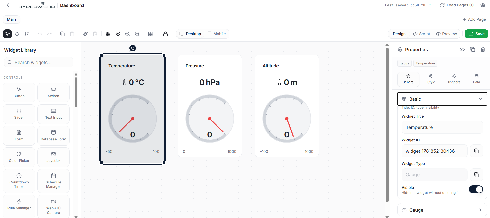
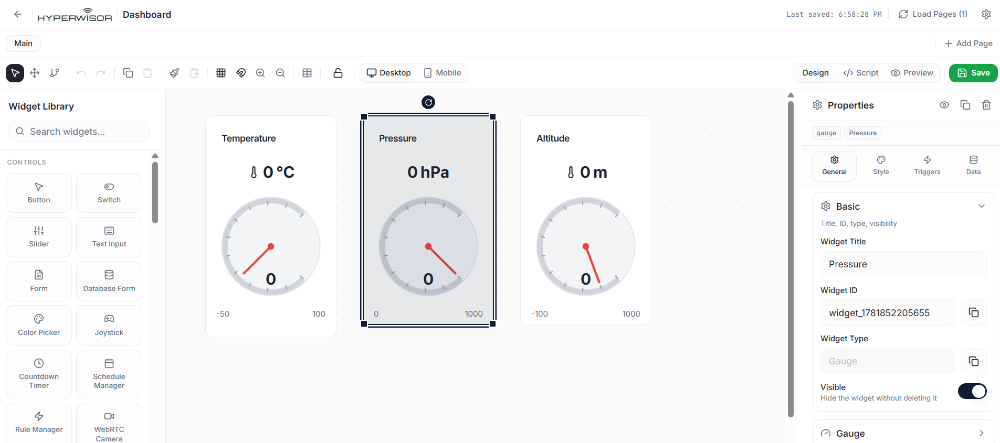
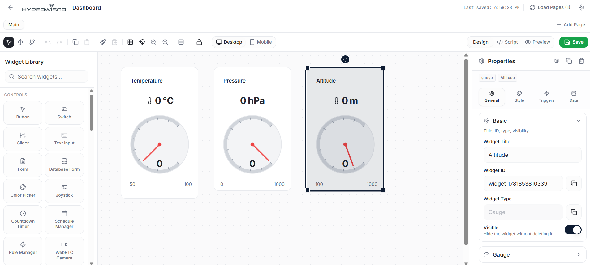

# Hyperwisor IoT BMP280 I2C Multi-Variable Climate Telemetry

A structured IoT controller project using an ESP32 micro-controller and the Hyperwisor IoT platform. This repository demonstrates how to configure an Inter-Integrated Circuit (I2C) communication bus using custom hardware pins to read and stream ambient temperature, atmospheric pressure, and calculated altitude simultaneously to independent dashboard widgets.

---

## 🚀 1. How Environment Sensor Networks Operate

Multi-variable atmospheric telemetry monitors steady environmental states. Because these metrics flow dynamically from the physical sensor directly up to your web dashboard without needing manual user interventions from a browser layout, it follows a **one-way telemetric pipeline**.

> 💡 **Architectural Best Practice:** For streaming environment sensor data, **you do not need to configure a Command Tree or assign nested dashboard actions.** The firmware functions completely independently of inbound platform event handlers. Data variables are gathered sequentially and pushed directly onto their distinct display elements using independent `device.updateWidget()` pipelines.

---

## 🎛️ 2. The Widget UI Builder Configuration

To render all three atmospheric variables in real-time, you must deploy three separate data visualization components onto your visual design canvas page:

1. Open your Hyperwisor interface canvas studio editor.
2. Drag three data display elements (such as a **Linear Chart**, **Radial Gauge**, or **Value Status Display**) onto your custom dashboard layout.
3. Select each component independently to view and edit its target settings configuration panel on the right.
4. Replace the placeholder `"WidgetId"` strings inside your code layout with the unique alphanumeric **Widget ID** tokens generated by the platform:
   * **Temperature Component Destination:** Update your specific `YOUR_TEMP_WIDGET_ID` target token.
   * **Pressure Component Destination:** Update your specific `YOUR_PRESS_WIDGET_ID` target token.
   * **Altitude Component Destination:** Update your specific `YOUR_ALT_WIDGET_ID` target token.

### 📸 Temperature Widget Setup Configuration


### 📸 Barometric Pressure Widget Setup Configuration


### 📸 Calculated Altitude Widget Setup Configuration


---

## ⚙️ 3. Hardware Circuit Design & I2C Logic

The BMP280 communicates using a high-speed, half-duplex synchronous **I2C (Inter-Integrated Circuit)** serial bus. This layout utilizes custom pin mapping to prevent resource conflicts with existing SPI or internal flash memory registers.

### Quick Wiring Rules
* **SDA (Serial Data Line):** Connect the sensor's `SDA` pin directly to **`GPIO 18`**.
* **SCL (Serial Clock Line):** Connect the sensor's `SCL` pin directly to **`GPIO 19`**.
* **Power Lines:** Connect the sensor's `VCC` pin to a stable $3.3\text{V}$ rail and tie the `GND` line to a common system ground (**`GND`**) terminal block pin on the ESP32.

> ⚠️ **I2C Bus Initialization:** Because standard ESP32 boards default to hardware pins 21 and 22 for I2C communication, your firmware must explicitly declare your custom routing paths using `Wire.begin(18, 19);` prior to initializing the sensor chip library via `bmp.begin(0x76);`.

---

## 💻 4. Firmware Architectural Flow & Calculations

The firmware handles multi-variable data capture inside a strict non-blocking interval window controlled by an asynchronous timer loop (`interval = 2000;`) to balance database parsing limits with stable tracking:

### A. Pressure Unit Conversion Physics
The Adafruit BMP280 library outputs raw atmospheric pressure measurements natively in **Pascals (Pa)**. To format the data cleanly for standard meteorological applications, the firmware applies an inline divisor conversion before uploading the data to the web pipeline:

$$\text{Pressure in Hectopascals (hPa)} = \frac{\text{Raw Reading in Pascals (Pa)}}{100.0}$$

### B. Barometric Altitude Calculations
Altitude cannot be read directly; it is mathematically derived using the relative difference between the sensor's local pressure sample and an established baseline sea level pressure reference parameter. The codebase initializes this calculation using a local parameter constant:

```cpp
float a = bmp.readAltitude(1010.8); // 1010.8 hPa represents local sea-level barometric pressure
