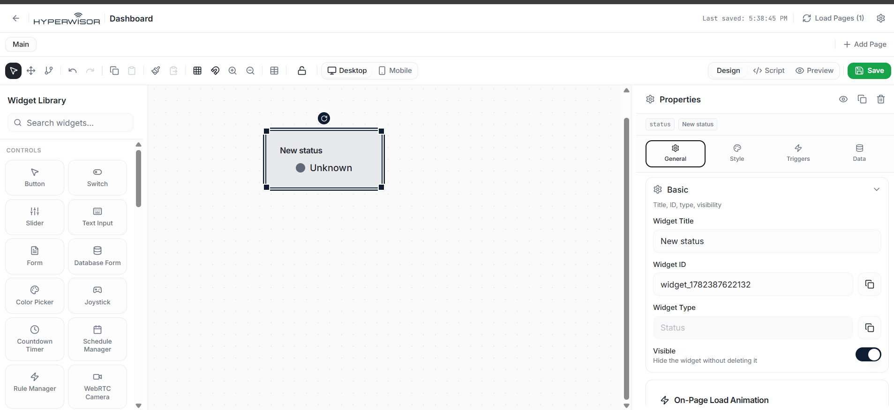

# Hyperwisor IoT Push Button State Detection

A structured IoT controller project using an ESP32 micro-controller and the Hyperwisor IoT platform. This repository demonstrates how to read a physical digital input sensor and stream status values up to the cloud interface in real-time.

---

## 🚀 1. How Telemetry Data Streams Differ from Commands

Unlike sliders, toggles, or switches—which accept actions generated by a user on a webpage—monitoring a physical component (like a button, temperature sensor, or proximity switch) utilizes a **one-way telemetric pipeline**.

> 💡 **Architectural Best Practice:** For reading external sensors or inputs, **you do not need to configure a Command Tree or assign actions.** Because the data originates entirely from the hardware, your firmware skips message parsing callbacks entirely. Instead, it uses `device.updateWidget()` to push raw strings or numerical packets directly onto the dashboard interface panel.

---

## 🎛️ 2. The Widget UI Builder Configuration

To display the incoming hardware status data streams, you must map a dedicated feedback widget inside your interface designer workspace:

1. Open your Hyperwisor visual canvas editor.
2. Drag a **Status** component (found inside the widget library sidebar) onto your custom dashboard page.
3. Select the Status component to reveal its properties section.
4. Note down the automatically generated **Widget ID** alphanumeric string parameter (e.g., `widget_1782387622132`). This specific string is what your firmware targets when flashing real-time event updates.

### 📸 Status Widget Dashboard Configuration

---

## ⚙️ 3. Hardware Circuit Design & Logic

This example is engineered to support an external **Pull-Down Resistor** network configuration to establish stable, interference-free logic levels:

### Quick Wiring Rules
* **Signal Pin Connection:** Route your physical push button signal terminal directly to a safe general-purpose pin (like **`GPIO 14`**). 
* **The 10k Resistor Path:** Connect a $10\,\text{k}\Omega$ resistor between your input line and the **`GND`** rail to force a stable resting potential.
* **Active-High Logic Loop:** When the switch sits idle, the resistor grounds out the channel resulting in a clear **`LOW` ($0$)** read. The moment you press the button down, current paths straight from the $3.3\text{V}$ line into the pin, forcing a clean **`HIGH` ($1$)** transition.

---

## 💻 4. Firmware Architectural Flow

The micro-controller loop continuously monitors the electrical state using an automated non-blocking debouncing sequence. Once a transition remains electrically stable past the specified $50\,\text{ms}$ mechanical vibration window, the firmware immediately forwards the respective text token string across the pipeline:

* **Button Pressed (`HIGH`):** Dispatches the custom payload string **`"Warning"`** to override the dashboard text box.
* **Button Released (`LOW`):** Dispatched the custom payload string **`"Safe"`** to reset the visual indicator panel automatically.
