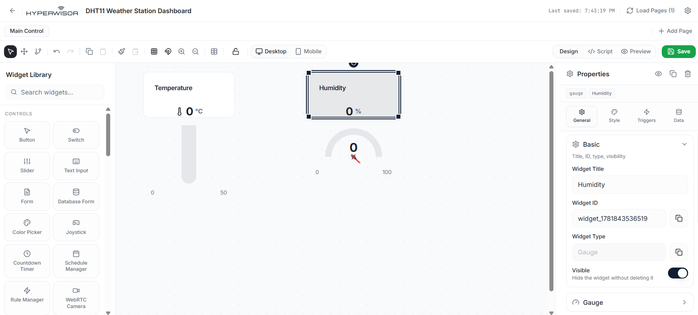

# Hyperwisor IoT DHT11 Temperature & Humidity Telemetry

A structured IoT controller project using an ESP32 micro-controller and the Hyperwisor IoT platform. This repository demonstrates how to read multi-variable environmental data (Temperature & Humidity) from a digital DHT11 sensor and stream it to separate cloud dashboard widgets asynchronously.

---

## 🚀 1. How Environmental Telemetry Streams Work

Environmental sensors like the DHT11 continuously collect real-time data from the physical world. Unlike user-controlled elements (such as buttons or sliders), this utilizes a **one-way telemetric pipeline**.

> 💡 **Architectural Best Practice:** For streaming sensor telemetry, **you do not need to configure a Command Tree or assign parent actions.** Because data packets originate entirely from the hardware layer, your firmware runs independently of incoming platform message callbacks. Instead, it directly routes floating-point variables up to individual cloud dashboard display elements using `device.updateWidget()`.

---

## 🎛️ 2. The Widget UI Builder Configuration

To display both environmental streams simultaneously, you must configure two separate telemetry tracking widgets inside your visual design canvas workspace:

1. Open your Hyperwisor visual layout editor.
2. Drag two monitoring components (such as a **Linear Chart**, **Gauge**, or **Value Display**) onto your custom layout page.
3. Select each component to verify its property configurations in the right-hand panel.
4. Bind your code destinations to match the unique **Widget ID** strings assigned by the platform:
   * **Temperature Target Destination:** Must match exactly: **`widget_1781843534936`**
   * **Humidity Target Destination:** Must match exactly: **`widget_1781843536519`**

### 📸 Dashboard UI Widget Setup

---

## ⚙️ 3. Hardware Circuit Design & Sampling Restrictions

The DHT11 sensor utilizes a proprietary single-bus synchronous serial protocol to pack data into an array. It requires specific hardware and timing considerations:

### Quick Wiring Rules
* **Signal Data Path:** Route the data pin (**`OUT`** or **`DATA`**) of your DHT11 sensor module straight to a safe general-purpose input pin, configured here on **`GPIO 4`**.
* **Power & Pull-Up:** Connect **`VCC`** to a stable $3.3\text{V}$ or $5\text{V}$ rail, and tie **`GND`** directly to an ESP32 ground pin. If your sensor module does not feature a built-in breakout board resistor, attach an external $4.7\,\text{k}\Omega$ to $10\,\text{k}\Omega$ pull-up resistor between the data line and the VCC line.

### 📸 Hardware Wiring & Pinout Reference

### ⚠️ The 2-Second Sampling Threshold Constraint
The DHT11 is a mechanically slow-response thermal element. Attempting to poll or query the internal registers faster than once every 2000 milliseconds will result in a data conflict, throwing validation reading errors (`nan` / Not-A-Number failures). 

To prevent data corruption or network bottleneck drops, this codebase implements a strict non-blocking interval filter set via `interval = 2000;`. This leaves the essential background core thread (`device.loop()`) free to fire socket network keep-alives at maximum processor execution speeds while constraining sensor polling to a healthy **$0.5\,\text{Hz}$** frequency window.
