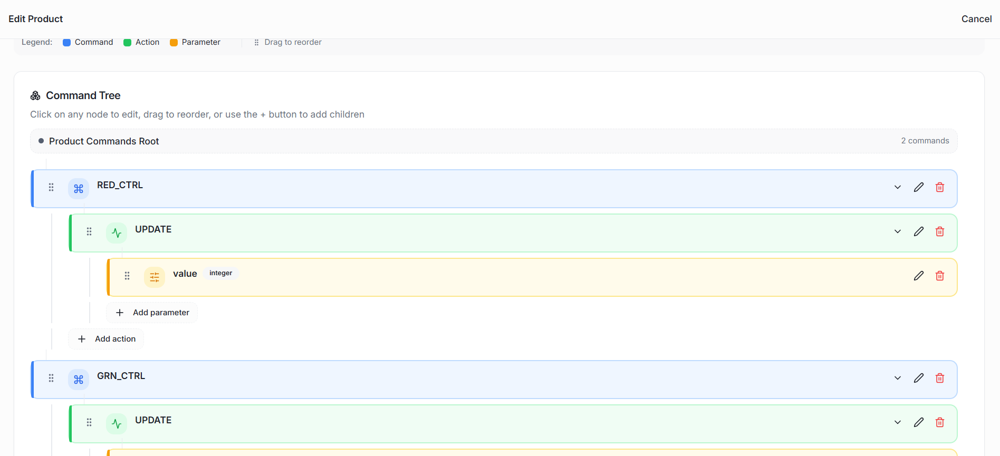
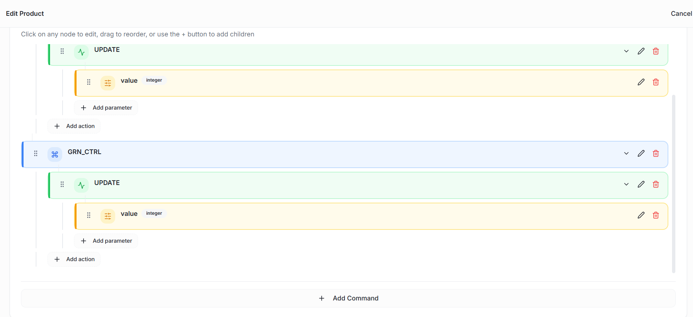
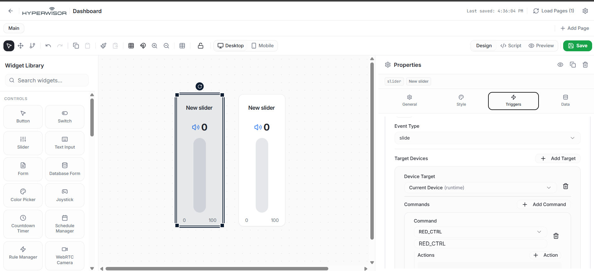
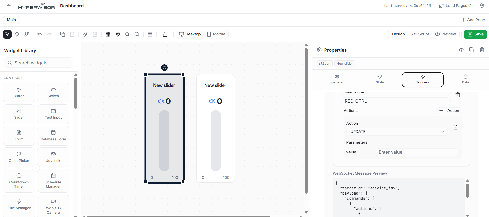
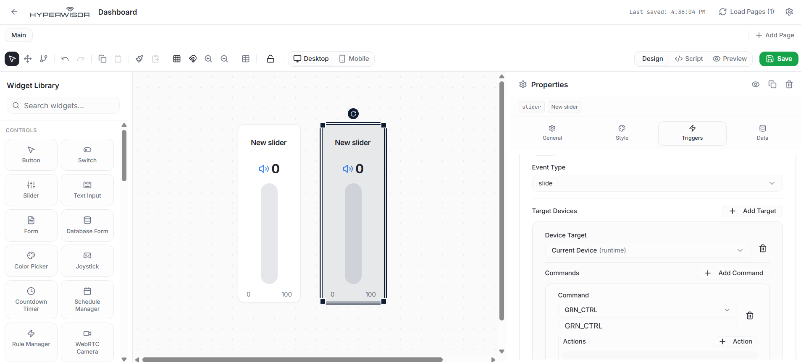
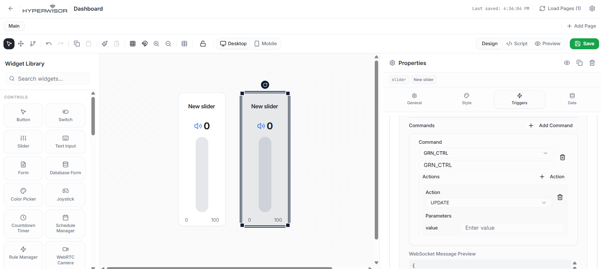

# Hyperwisor IoT Multi-Axis LED PWM Control

A structured IoT controller project using an ESP32 micro-controller and the Hyperwisor IoT platform. This repository demonstrates how to pass continuous integer parameters (0-255) down through a hierarchical **Command Tree** using analog sliders to dynamically alter physical LED brightness.

---

## 🚀 1. How the Hyperwisor Dashboard Works

The Hyperwisor web platform manages continuous analog streams using decoupled canvas elements paired with backend variable routing.

### The Widget UI Builder
* **Visual Canvas:** Interface controls (such as the twin **Slider** widgets utilized here) are placed onto a graphical drag-and-drop workspace.
* **Widget Identity Mapping:** Every slider tracking element contains a distinct reference string. To push physical telemetry states back to the cloud, you must pass these unique IDs inside your firmware's status sync loops.

### The Trigger Framework
* **Event Actions:** Tearing or shifting a slider handle fires a continuous tracking parameter event (Event Type: `slide`).
* **Target Mapping:** The platform aggregates the real-time slider value, nests it inside a JSON parameters payload, and pushes it immediately down the pipeline to your target hardware.

---

## 🌲 2. Configuring the Commands Visual Builder

Instead of simple on/off states, this configuration maps structured command trees that carry dynamic parameter data types (integers) to drive PWM micro-controller registers:

$$\text{Command Group (Control Bus)} \longrightarrow \text{Action: UPDATE} \longrightarrow \text{Parameter: value (Integer)}$$

### Step-by-Step Command Tree Setup
1. Open the platform's **Commands Visual Builder** workspace.
2. Generate your primary command containers to handle the separate hardware color channels:
   * **`RED_CTRL`**: Manages the Red LED channel.
   * **`GRN_CTRL`**: Manages the Green LED channel.
3. Nested beneath **each** root command container, attach a child action string named exactly: **`UPDATE`**.
4. Click `+ Add parameter` directly inside each `UPDATE` block to configure a parameter string payload named **`value`** and assign its data type attribute to **`integer`**.

### 📸 Command Tree Reference Diagram

---

## 🎛️ 3. Binding Sliders to Command Triggers

To tie your canvas slider components to the dual-channel control configuration bus, configure their internal event rules using the **Triggers** properties panel:

### Configuring Slider 1 (Red LED Control)
1. Select the left slider element on the visual design canvas to reveal its configuration tabs.
2. Switch over to the **Triggers** options window.
3. Set the **Event Type** dropdown parameter to **`slide`**.
4. Add a target routing path pointing cleanly to **`Current Device (runtime)`**.
5. Map the target container dropdown option to **`RED_CTRL`**, point the execution action string to **`UPDATE`**, and ensure the incoming parameter mappings are bound to the `value` context.

### 📸 Red Slider Trigger Mapping

### Configuring Slider 2 (Green LED Control)
1. Select the right slider element on your design workspace.
2. In the **Triggers** panel, change the **Event Type** rule selector down to **`slide`**.
3. Point your device target link straight to **`Current Device (runtime)`**.
4. Reassign the parent category path block down onto **`GRN_CTRL`**, assign its action tracking line to **`UPDATE`**, and configure its incoming value string parameter.

### 📸 Green Slider Trigger Mapping

---

## 💻 4. Firmware Architectural Flow

The firmware loop isolates the custom incoming payload values by explicitly checking for the registered parent containers (`RED_CTRL` or `GRN_CTRL`) and filtering deeper down to extract the nested `["params"]["value"]` array.

Because this hardware setup handles an active-low common anode profile layout, your back-end logic functions must handle the integer mappings inversely to complete the hardware ground loops:
* An integer data stream value of **`255`** scales the hardware register down to its minimum (`255 - 255 = 0`), delivering maximum brightness.
* An integer data stream value of **`0`** brings the pin output to high potential (`255 - 0 = 255`), breaking the path and leaving the physical channel completely unlit on initial boot.
