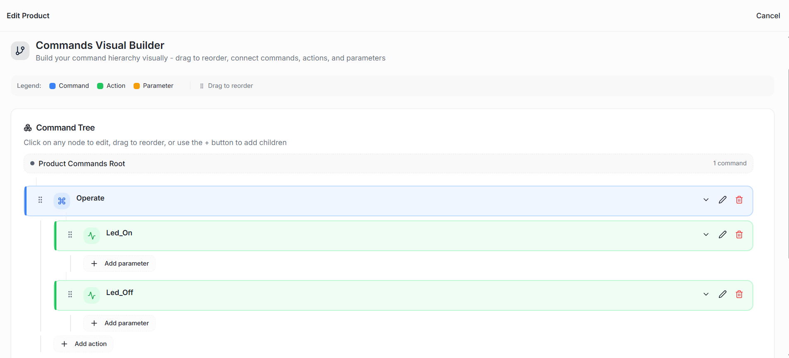
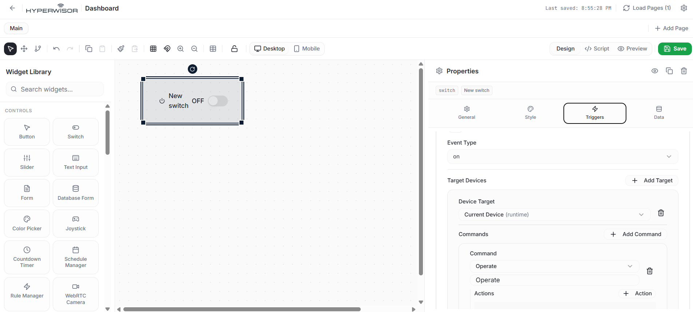
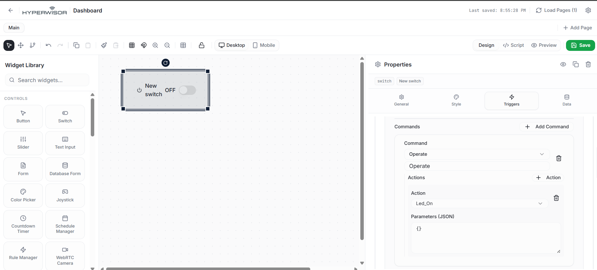
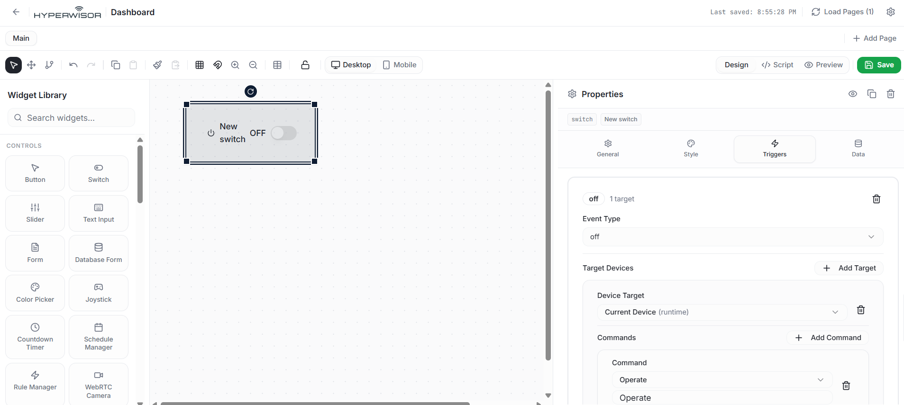
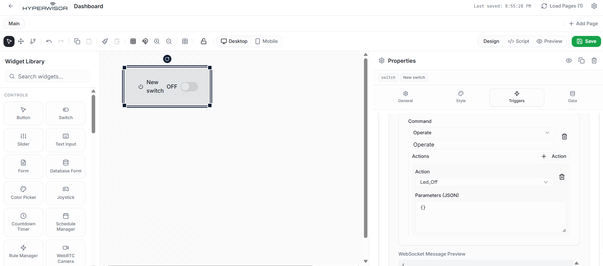

# Hyperwisor IoT Smart Switch Control

A structured IoT controller project using an ESP32 micro-controller and the Hyperwisor IoT platform. This repository demonstrates how to implement a hierarchical **Command Tree** (Commands & Actions) to control physical hardware via an online WebSocket dashboard.

---

## 🚀 1. How the Hyperwisor Dashboard Works

The Hyperwisor web platform manages operations using an isolated frontend layout bound to structured backend event handlers.

### The Widget UI Builder
* **Visual Canvas:** Interface controls (like the **Switch** widget used here) are placed onto a graphical drag-and-drop grid canvas.
* **Widget Identity Mapping:** Every single widget contains a unique reference identifier string (e.g., `widget_1775734631853`). To synchronize states, this exact ID string must be hardcoded inside your device firmware update loops.

### The Trigger Framework
* **Event Actions:** When you toggle a switch to an **ON** or **OFF** state on your web page, it fires an **Event Type** rule parameter.
* **Target Mapping:** The platform instantly packages this event state and delivers it directly down the pipeline to your specified **Target Device**.

---

## 🌲 2. Configuring the Commands Visual Builder

Instead of scattering random unmapped parameters across basic network registers, this platform establishes a structured layout called a **Command Tree**. This creates a clean hierarchical relationship matching your backend firmware filters:

$$\text{Command Category} \longrightarrow \text{Specific Isolated Action}$$

### Step-by-Step Command Tree Setup
1. Open the platform's **Commands Visual Builder** menu.
2. Under the **Product Commands Root**, create a new parent **Command** node by clicking the `+` button. Name this root command container exactly: `Operate`.
3. Click the `+ Action` option directly underneath your new `Operate` container to generate nested children operations.
4. Add your two distinct execution targets:
   * **`Led_On`**: The active execution branch.
   * **`Led_Off`**: The resting execution branch.

### 📸 Command Tree Reference Diagram


---

## 🎛️ 3. Binding Actions to Widget Triggers

To make your frontend UI toggle switch actually broadcast these commands down to the hardware, you must bind them manually via the **Triggers** panel on the right side of the canvas designer:

### Setting Up the "ON" Event (Flipping the Switch Right)
1. Select your UI switch element on the canvas to open its **Properties** tab.
2. Navigate to the **Triggers** settings segment.
3. Set the **Event Type** dropdown selector parameter to **`on`**.
4. Click `+ Add Target` and configure the **Device Target** option to **`Current Device (runtime)`**.
5. Click `+ Add Command` and pull down the category option to **`Operate`**.
6. Click `+ Action` underneath that container, and pair it with the specific string **`Led_On`**. Leave the Parameters (JSON) input field empty (`{}`).

### 📸 "ON" Trigger Reference Diagram



### Setting Up the "OFF" Event (Flipping the Switch Left)
1. Add an additional trigger block within the same menu window.
2. Shift the **Event Type** condition box down to read **`off`**.
3. Set the target routing line to **`Current Device (runtime)`**.
4. Target the parent command block back onto **`Operate`**.
5. Underneath the action block assignment box, switch the target label to read **`Led_Off`**.

### 📸 "OFF" Trigger Reference Diagram



---

## 💻 4. Firmware Integration Guide

Your micro-controller hooks into the incoming stream inside the `handleCommands()` function. It reads the raw JSON object structure and filters it using library calls:

```cpp
void handleCommands(JsonObject& msg) {
  JsonObject payload = msg["payload"];

  // 1. Isolate the top-level command category
  JsonObject cmd = device.findCommand(payload, "Operate");
  if (!cmd.isNull()) {
    
    // 2. Filter for the specific inner Action requested
    JsonObject act_on = device.findAction(payload, "Operate", "Led_On");
    if (!act_on.isNull()) {
      Led_On(); // Executes physical pin logic
    }

    JsonObject act_off = device.findAction(payload, "Operate", "Led_Off");
    if (!act_off.isNull()) {
      Led_Off();
    }
  }
}
