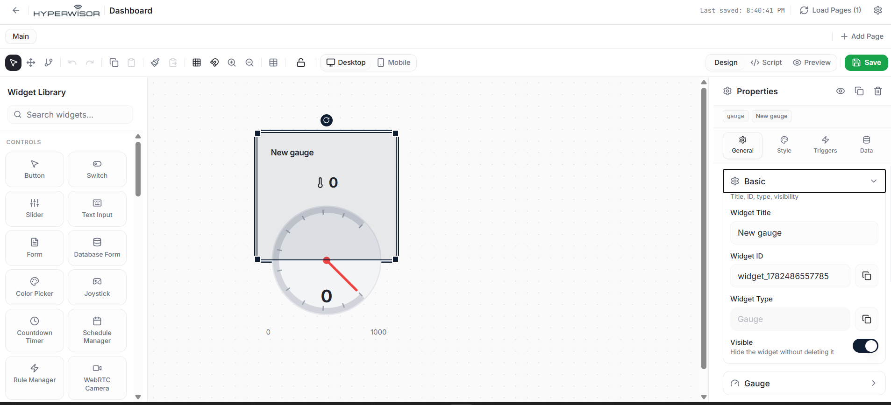

# Hyperwisor IoT MQ Gas Sensor Analog Telemetry

A structured IoT controller project using an ESP32 micro-controller and the Hyperwisor IoT platform. This repository demonstrates how to read continuous 12-bit analog voltage potentials from an MQ-series gas sensor and stream the raw telemetry data up to a cloud interface in real-time.

---

## 🚀 1. How Telemetry Data Streams Differ from Commands

Unlike components that accept user input from a webpage (like sliders or toggles), monitoring an analog sensor utilizes a **one-way telemetric pipeline**.

> 💡 **Architectural Best Practice:** For reading external sensors or telemetry streams, **you do not need to configure a Command Tree or assign nested actions.** Because the data package originates entirely from the hardware side, your firmware completely skips message parsing callbacks. Instead, it pushes raw integer packets directly to the dashboard display panel using `device.updateWidget()`.

---

## 🎛️ 2. The Widget UI Builder Configuration

To capture and visualize the incoming gas concentration data streams, you must map a monitoring element inside your interface designer workspace:

1. Open your Hyperwisor visual canvas editor.
2. Drag an analog data display element (such as a **Linear Chart**, **Gauge**, or **Value Display** component) from the widget library onto your active dashboard page.
3. Select the component to open its properties section on the right side of the editor.
4. Note down or copy the automatically generated **Widget ID** alphanumeric string parameter. For this example, ensure it matches exactly: **`widget_1782486557785`**. This identifier string targets your data packet destination.

### 📸 Sensor Widget Dashboard Reference

---

## ⚙️ 3. Hardware Circuit Design & ADC Logic

This example handles raw voltage conversions by accessing the internal Analog-to-Digital Converter (ADC) peripheral block on the ESP32:

### Quick Wiring Rules
* **Analog Signal Path:** Route the analog output pin (**`AO`**) of your MQ gas sensor module directly to **`GPIO 34`**. 
* **The Power Rail:** Connect the sensor's **`VCC`** pin to a stable power rail ($5\text{V}$ or $3.3\text{V}$, depending on your specific MQ module board specifications).
* **Common Ground:** Tie the sensor's **`GND`** terminal directly to a **`GND`** pin on the ESP32. A shared common ground reference is mandatory for the ADC circuit to read accurate potential differences.

### Understanding the 12-Bit Resolution Scale
The ESP32 samples incoming voltage ranges on a native 12-bit resolution grid. This scales your physical gas concentrations into a raw numerical data range between **$0$ and $4095$**:
* **`0`**: Represents a clean baseline ($0\text{V}$ potential).
* **`4095`**: Represents full-scale voltage exposure ($3.3\text{V}$ potential).

---

## 💻 4. Firmware Architectural Flow

The firmware utilizes a non-blocking execution block to govern how frequently data is transmitted over the network stack:

* **Sampling Rate Interval:** The interval is controlled by the `Delay = 50;` constraint definition. This ensures the micro-controller samples the ADC pin and streams updates at a steady, controlled rate of **$20\,\text{Hz}$** (once every $50\,\text{ms}$).
* **Diagnostic Hardware Logging:** Local terminal tracking statements (`Serial.print`) feed live updates directly to your local computer terminal via a $115200$ baud line. These print statements are purely diagnostic; they provide physical feedback during testing and **do not change the core execution or network behavior of the firmware**.
