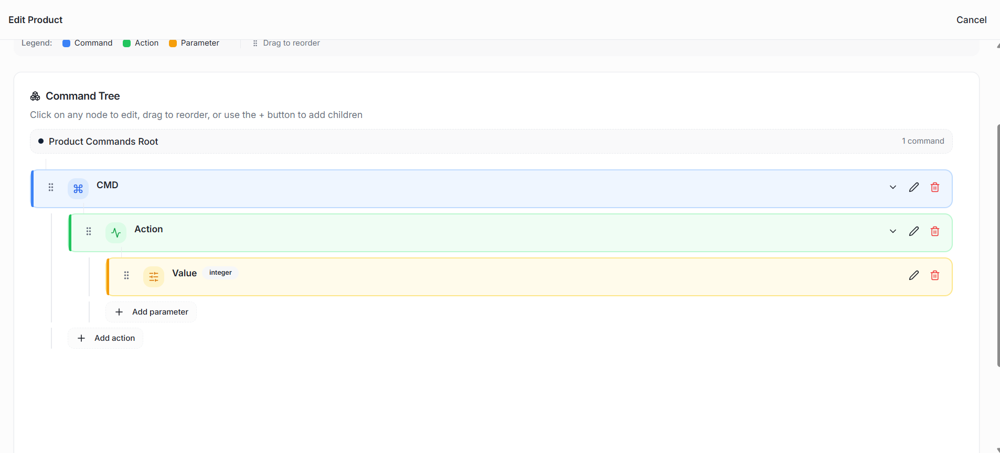
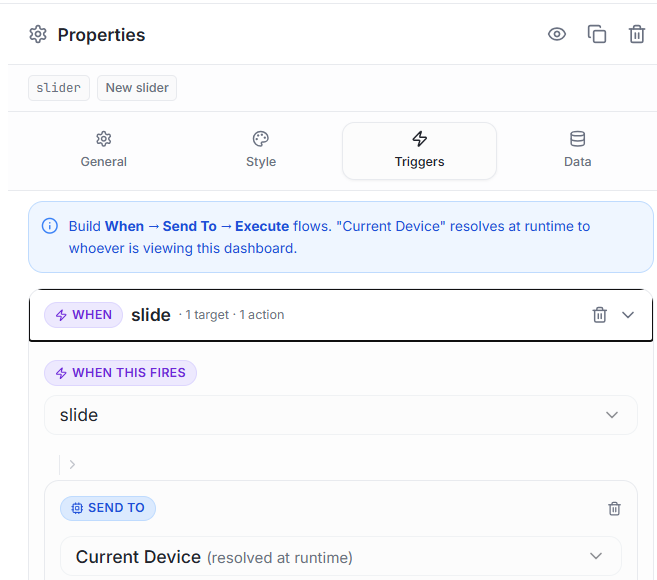
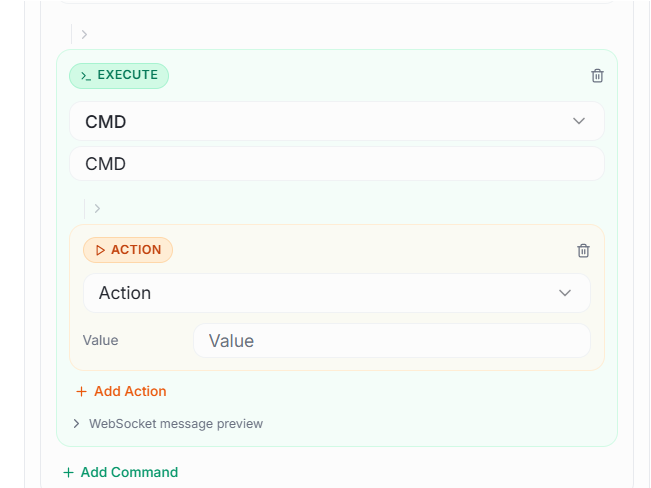

# Hyperwisor IoT Zero-Lag Asynchronous Servo Controller

A structured IoT controller project using an ESP32 micro-controller and the Hyperwisor IoT platform. This repository demonstrates how to execute zero-lag physical servo actuation by handling rapid inbound slider commands using global volatile variables while safely syncing dashboard states via an independent, non-blocking telemetry timer.

---

## 🚀 1. How the Hyperwisor Dashboard Works

The Hyperwisor web platform manages continuous analog user inputs using decoupled canvas elements paired with backend variable routing pipelines.

### The Widget UI Builder
* **Visual Canvas:** Interface controls (such as the **Slider** widget utilized here) are placed onto a graphical drag-and-drop workspace grid.
* **Widget Identity Mapping:** Every slider tracking element contains a distinct reference string. To push the confirmed physical servo telemetry state back to the cloud without choking the input pipeline, you must pass this unique ID string (e.g., `WidgetId`) inside your firmware's asynchronous telemetry update block.

### The Trigger Framework
* **Event Actions:** Moving or dragging the slider handle fires a continuous tracking parameter event (Event Type: `slide`).
* **Target Mapping:** The platform aggregates the real-time slider position percentage ($0$ to $100$), nests it inside a JSON parameters payload, and pushes it immediately down the pipeline to your target hardware.

---

## 🌲 2. Configuring the Commands Visual Builder

To map your dashboard slider component to the servo control bus, you must establish a structured Command Tree inside your development profile workspace:

$$\text{Command Group: CMD} \longrightarrow \text{Action: Action} \longrightarrow \text{Parameter: value (Integer)}$$

### Step-by-Step Command Tree Setup
1. Open the platform's **Commands Visual Builder** workspace.
2. Generate your primary root command container to handle the incoming motor instructions:
   * **`CMD`**: Manages the core control data stream.
3. Nested beneath the `CMD` container, attach a child execution action string named exactly: **`Action`**.
4. Click `+ Add parameter` inside the `Action` block to configure a parameter string payload named **`value`** and assign its data type attribute to **`integer`**.

### 📸 Command Tree Reference Diagram

---

## 🎛️ 3. Binding Sliders to Command Triggers

To tie your canvas slider component to the control configuration bus, configure its internal event rules using the **Triggers** properties panel:

### Configuring the Slider Control
1. Select the slider element on the visual design canvas to reveal its configuration tabs on the right side of the editor.
2. Switch over to the **Triggers** options window.
3. Set the **Event Type** dropdown parameter to **`slide`**.
4. Add a target routing path pointing cleanly to **`Current Device (runtime)`**.
5. Map the target container dropdown option to **`CMD`**, point the execution action string to **`Action`**, and ensure the incoming parameter mappings are bound to the `value` context.

### 📸 Slider Trigger Mapping Mappings

---

## 💻 4. Firmware Architectural Flow & Optimization

This firmware configuration implements an asynchronous design pattern specifically engineered to eliminate network latency and structural servo stutter:

### A. The Thread Decoupling Pattern
When a user drags a dashboard slider, the cloud flashes dozens of JSON payload packets per second down the WebSocket connection. If the micro-controller attempts to actuate the motor or send tracking updates back to the cloud inside the same synchronous worker function (`handleCommands`), the network stack buffer bottlenecks immediately. 

To solve this, the codebase instantly offloads the value to **global volatile variables** (`targetAngle`, `currentSliderVal`) and trips a fast execution flag (`newCommandAvailable = true`). The network callback thread terminates instantly, keeping the WebSocket pipeline free.

### B. Hardware Actuation & Pulse Calibration
The main execution loop catches the tripped flag outside the network routine and instantly jumps to actuate the physical motor.
* **Valid Output Pin Mapping:** The servo signal line is bound to **`GPIO 18`**. This moves the hardware layout away from the input-only pins (34–39) which lack physical output drivers.
* **Pulse-Width Stretching:** The initialization utilizes `servo.attach(mtr, 500, 2400);`. Passing these explicit minimum ($500\,\mu\text{s}$) and maximum ($2400\,\mu\text{s}$) timing parameters recalibrates standard hobbyist servos (such as the SG90 or MG90S) to achieve their full, unconstrained **$0^\circ$ to $180^\circ$ physical travel range**.

### C. Safe Asynchronous Telemetry Update Loop
To keep the dashboard interface layout synchronized with the micro-controller without triggering a data collision feedback loop, status packages are isolated using a non-blocking `millis()` subtraction filter set to `uploadDelay = 500;`. This safely constrains outbound data rates to a healthy **$2\,\text{Hz}$ frequency limit**, protecting the cloud socket server from rate-limiting penalties while keeping hardware response instantaneous.
