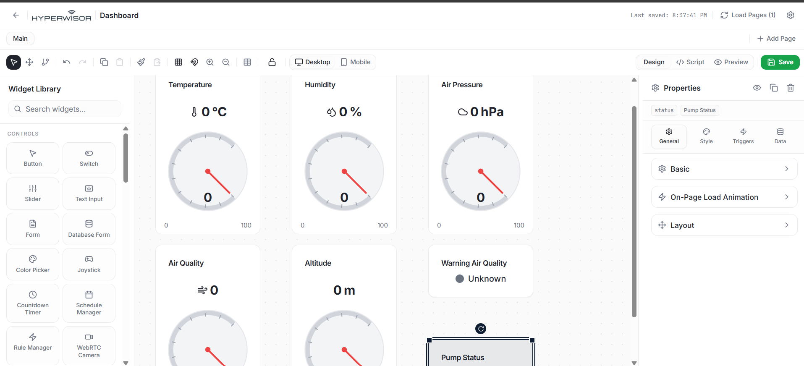
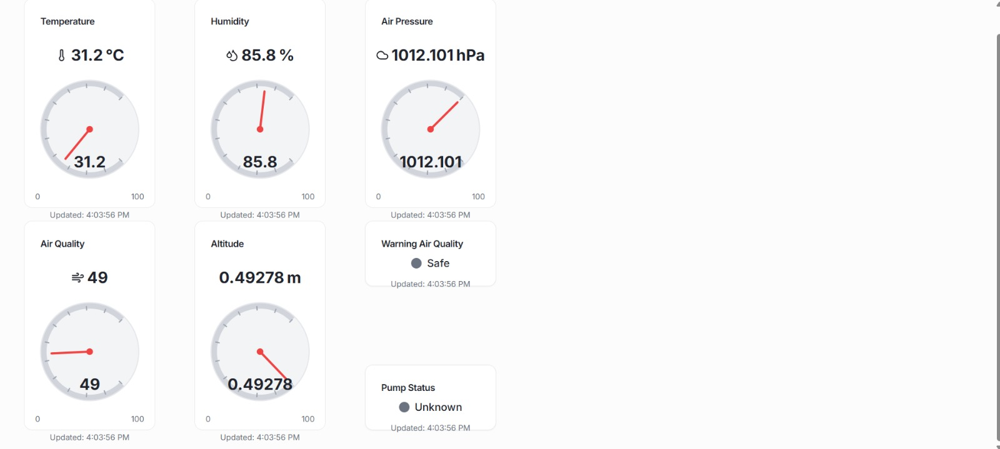
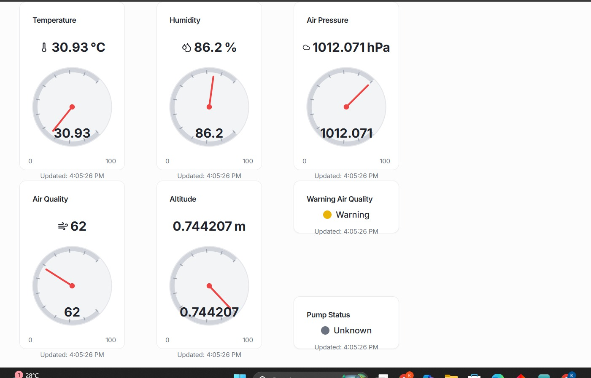
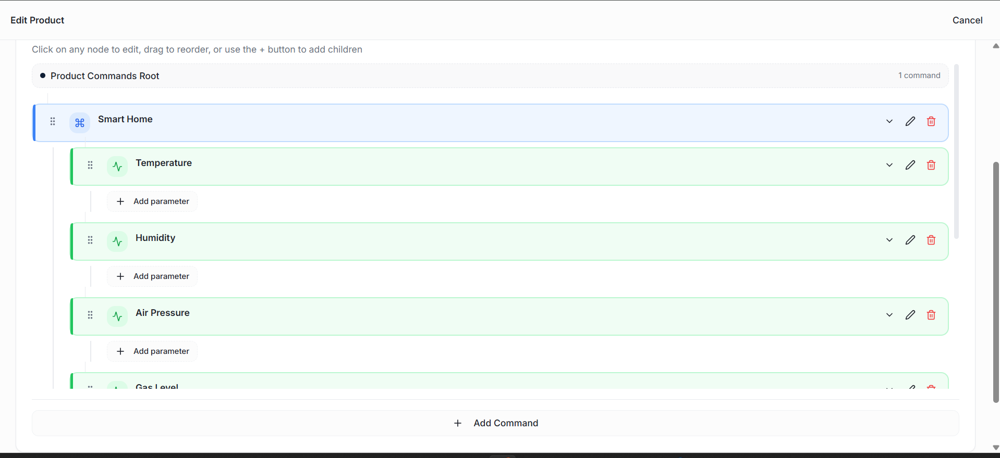
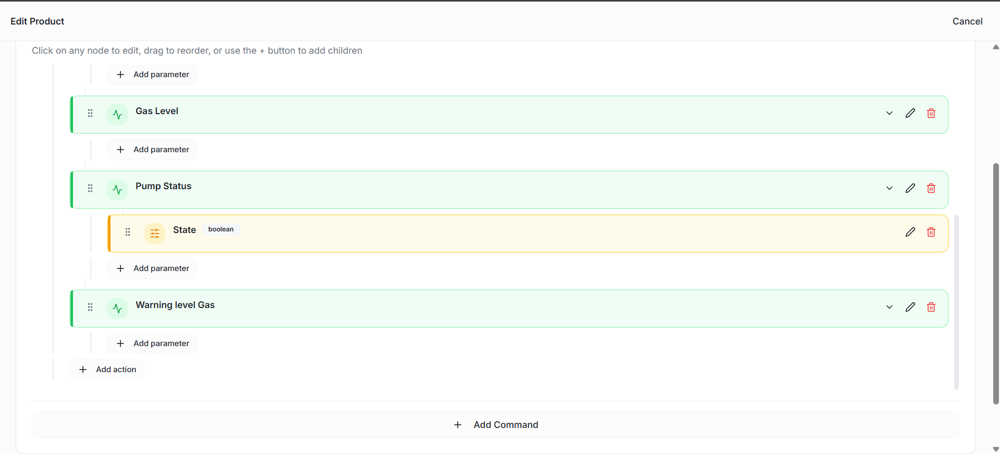

# Hyperwisor IoT Weather Station & Gas Safety Monitor

A multi-sensor environmental telemetry project using an ESP32 micro-controller and the Hyperwisor IoT platform. This system reads real-time humidity, temperature, barometric pressure, calculated altitude, and gas concentrations, streaming all variables seamlessly to a central monitoring dashboard.

---

## 🚀 1. How the Dashboard Telemetry Works

This project runs entirely on a **one-way telemetric data pipeline** for the sensor arrays, along with a **Command Tree configuration** for threshold-based safety overrides. 

* **Sensor Telemetry:** The environment metrics (Humidity, Temperature, Pressure, Altitude) and the raw Gas Percentage are pushed directly from the ESP32 hardware up to the cloud canvas components.
* **Safety Threshold Commands:** When gas density crosses a dangerous threshold, the firmware triggers automated cloud command states to toggle status alert displays.

---

## 🎛️ 2. Dashboard Widget Configuration & Demo

To visualize your environmental station data, map five telemetry display units and one digital alert component inside your interface designer workspace.

### The Tracking Widgets
1. **Humidity Tracker:** A status display or chart bound to ID: `widget_1781933849014`
2. **Temperature Tracker:** Replace placeholder string with your specific Temperature **Widget ID**
3. **Barometric Pressure:** Replace placeholder string with your specific Pressure **Widget ID**
4. **Altitude Tracker:** Replace placeholder string with your specific Altitude **Widget ID**
5. **Gas Level Indicator:** A gauge or linear progress widget showing mapped values ($0-100\%$)
6. **Gas Status Alert Banner:** A digital indicator block showing raw status string evaluations (`"Safe"` or `"Warning"`)

### 📸 Workspace Interface Canvas Setup

### 📸 Active Dashboard Demonstration & Telemetry Operations

---

## 🌲 3. Configuring the Commands Visual Builder

To support the threshold validation logic, ensure your backend profile workspace contains the registered command container hierarchy configurations:

$$\text{Command Container Group} \longrightarrow \text{Action Target} \longrightarrow \text{Parameter State}$$

### 📸 Command Tree Hierarchy Configurations

---

## ⚙️ 4. Hardware Circuit Design & Pin Mapping

The multi-sensor node runs on separate interface buses managed by the ESP32 system:

### Quick Wiring Rules
* **DHT11 (Digital Temperature & Humidity):** Connect the `DATA` terminal pin directly to **`GPIO 4`**.
* **BMP280 (I2C Barometer Sensor):** Connect `SDA` to **`GPIO 18`** and `SCL` to **`GPIO 19`**. Initialize at I2C address `0x76`.
* **MQ Gas Sensor (Analog Input):** Connect the analog output (`AO`) pin directly to **`GPIO 34`** (ADC1_CH6).

---

## 💻 5. Firmware Execution Logic

The firmware uses a non-blocking interval timer (`2500ms`) to poll all hardware channels simultaneously every **$2.5\,\text{seconds}$** without straining the underlying network socket layer:

1. **DHT11 Routine:** Reads relative humidity percentages.
2. **BMP280 Routine:** Captures ambient temperature and barometric pressure (applying a local $+1.56\,\text{hPa}$ sea-level pressure offset adjustment tailored for regional Kochi conditions).
3. **Gas Monitoring Logic:** * Reads raw 12-bit ADC data ($0-4095$).
   * Maps typical operational sensor fluctuations ($1600-4095$) to a clean $0-100\%$ linear scale for the dashboard gauge.
   * If raw voltage levels breach the strict **`3000`** calibration threshold limit, it flashes an asynchronous high-priority `"Warning"` override string packet down the pipeline. Otherwise, it maintains a `"Safe"` baseline operational signal.
